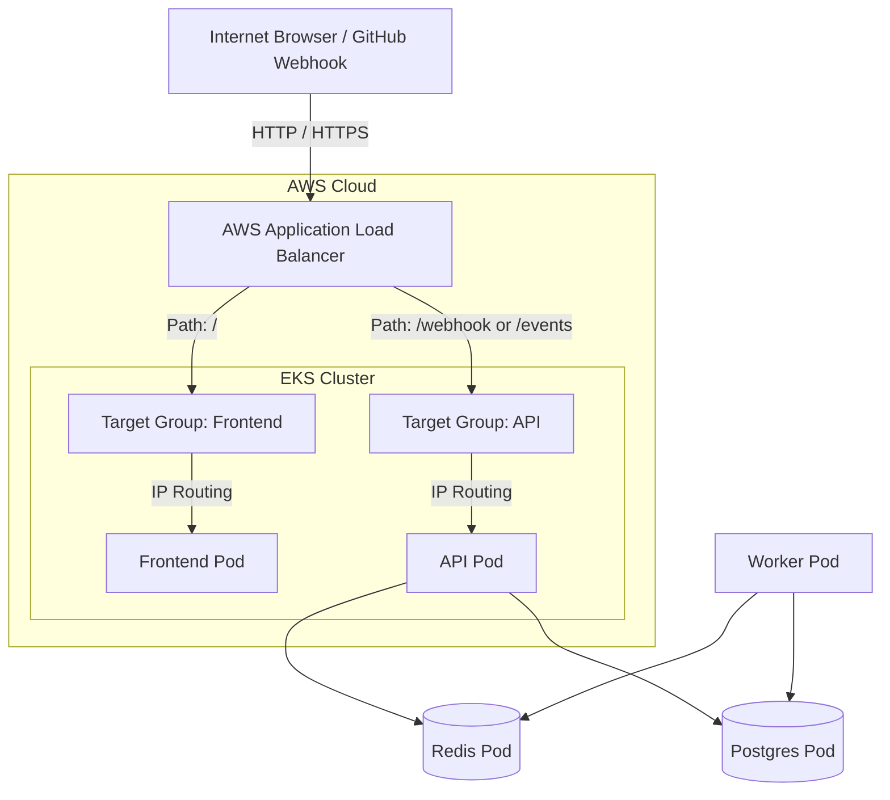

# Ingress and AWS Load Balancer Controller Setup Plan

This plan outlines the architecture, concepts, and step-by-step implementation for setting up **Kubernetes Ingress** and the **AWS Load Balancer Controller (LBC)** on your AWS EKS cluster. This will expose your Frontend dashboard and API server securely to the public internet through a single AWS Application Load Balancer (ALB).

---

## Conceptual Explanation: How it Works

### 1. What is an Ingress in Kubernetes?
In Kubernetes, a **Service** of type `NodePort` or `ClusterIP` exposes your application internally or on a specific port of each worker node. 
An **Ingress** is an API object that manages external access to the services in a cluster, typically HTTP/HTTPS. It acts as a **traffic router** and **reverse proxy**, allowing you to define routing rules (e.g., `/` goes to `frontend`, and `/webhook` goes to `api`) through a single public domain or IP address.

### 2. What is the AWS Load Balancer Controller (LBC)?
An Ingress resource by itself is just a set of rules—it does nothing without an **Ingress Controller** to implement it.
The **AWS Load Balancer Controller** is a controller that runs inside your EKS cluster. It watches for `Ingress` and `Service` resources:
* When you declare a Kubernetes `Ingress` resource with the annotation `ingressClassName: alb`, the LBC automatically communicates with the AWS ELB API to provision a physical, fully managed **AWS Application Load Balancer (ALB)**.
* It creates **Target Groups** pointing to your EKS pods and configures **Listener Rules** matching the paths defined in your Ingress manifest.



### 3. Key Concepts to Master:
* **Target Type (`ip` vs `instance`)**:
  * `ip` (Recommended): ALB routes traffic directly to the pod's IP address. This bypasses the node's kube-proxy and `NodePort`, resulting in lower latency and better load balancing.
  * `instance`: ALB routes traffic to the worker nodes' ports (`NodePort`). kube-proxy then routes the traffic to the pods.
* **Subnet Discovery**:
  The AWS Load Balancer Controller automatically discovers public subnets in your VPC to deploy the public ALB. It does this by scanning for subnets tagged with `kubernetes.io/role/elb = 1`. (Our VPC module already has this tag configured!).
* **IAM Roles for Service Accounts (IRSA)**:
  Since the LBC runs as a pod inside Kubernetes but needs to create/modify physical AWS resources (ALBs, target groups, security groups), it uses IRSA. EKS hooks into AWS IAM via OpenID Connect (OIDC) to grant the pod's Kubernetes `ServiceAccount` a specific AWS IAM Role with the necessary permissions, adhering to the principle of least privilege.

---

## Proposed Changes

### Component 1: Terraform Infrastructure (IAM Permissions)

#### [NEW] [lbc-iam.tf](file:///home/mudasirmattoo/Projects/github-event-system/terraform/lbc-iam.tf)
We will create a new Terraform configuration file to manage LBC credentials:
* Define the LBC IAM Policy using the official AWS Load Balancer Controller permissions.
* Create the LBC IAM Role and set up an OIDC trust relationship between the EKS cluster and the Kubernetes service account `aws-load-balancer-controller` in the `kube-system` namespace.
* Attach the policy to the role and export the IAM Role ARN.

---

### Component 2: Kubernetes Manifests

#### [NEW] [ingress.yaml](file:///home/mudasirmattoo/Projects/github-event-system/k8s/ingress.yaml)
We will create an Ingress manifest to define the load balancer settings and path-based routing:
```yaml
apiVersion: networking.k8s.io/v1
kind: Ingress
metadata:
  name: github-event-system-ingress
  annotations:
    # Use the AWS Application Load Balancer
    alb.ingress.kubernetes.io/scheme: internet-facing
    # Route traffic directly to Pod IPs for maximum performance
    alb.ingress.kubernetes.io/target-type: ip
    # Group load balancers or customize health checks if needed
    alb.ingress.kubernetes.io/healthcheck-path: /events
    alb.ingress.kubernetes.io/healthcheck-port: "8080"
spec:
  ingressClassName: alb
  rules:
  - http:
      paths:
      # Route Webhook ingestion to API
      - path: /webhook
        pathType: Exact
        backend:
          service:
            name: api
            port:
              number: 8080
      # Route Events retrieval to API
      - path: /events
        pathType: Exact
        backend:
          service:
            name: api
            port:
              number: 8080
      # Route all other dashboard traffic to Frontend
      - path: /
        pathType: Prefix
        backend:
          service:
            name: frontend
            port:
              number: 80
```

---

## Verification Plan

### Automated/Manual Execution Checklist

1. **Install Helm Binary Locally**:
   ```bash
   curl -fsSL -o helm.tar.gz https://get.helm.sh/helm-v3.14.0-linux-amd64.tar.gz
   tar -zxvf helm.tar.gz
   mv linux-amd64/helm ./helm-bin
   rm -rf linux-amd64 helm.tar.gz
   ```
2. **Apply Terraform IAM configurations**:
   ```bash
   terraform apply -auto-approve
   ```
3. **Install AWS Load Balancer Controller Chart**:
   Add the EKS Helm chart repository and install the controller pod into `kube-system`:
   ```bash
   ./helm-bin repo add eks https://aws.github.io/eks-charts
   ./helm-bin repo update
   ./helm-bin install aws-load-balancer-controller eks/aws-load-balancer-controller \
     -n kube-system \
     --set clusterName=github-event-system-eks \
     --set serviceAccount.create=true \
     --set serviceAccount.name=aws-load-balancer-controller \
     --set serviceAccount.annotations.eks\.amazonaws\.com/role-arn=<LBC_IAM_ROLE_ARN>
   ```
4. **Verify Controller Startup**:
   ```bash
   kubectl get deployment -n kube-system aws-load-balancer-controller
   kubectl get pods -n kube-system -l app.kubernetes.io/name=aws-load-balancer-controller
   ```
5. **Apply Ingress Manifest**:
   ```bash
   kubectl apply -f k8s/ingress.yaml
   ```
6. **Verify ALB Creation**:
   Watch the Ingress resource until EKS assigns the public ALB DNS hostname:
   ```bash
   kubectl get ingress -w
   ```
7. **Test Endpoints**:
   Visit the printed ALB address in your browser (e.g. `http://k8s-default-githubev-xxxxxx.us-east-1.elb.amazonaws.com`) to verify that `/` loads the dashboard and `/events` pulls the database logs!
